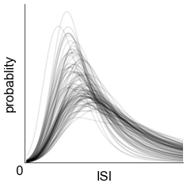

# Bayesian nonparametric (non-)renewal processes

 

### Overview

This is the code repository for this [paper]().
Models are implemented in Python and JAX with dependencies on libraries listed below at the end.
See notebooks in `notebooks/` for a basic usage overview.
See `scripts/` for model fitting, analysis and plotting code.

### Motivation

TODO:
- rename BNPP to NPNR, rho to lambda in code

- plot the tuning for baseline models, and ISIs as well
- Try plot the tunings of baseline models too, e.g. rate and CV of those models... if time permits, use conditional with same past spike as the one used for that

- put library subset in and change path imports

### Dependencies:
#. [JAX](https://jax.readthedocs.io/en/latest/#)
#. [NumPy](https://numpy.org/)
#. [SciPy](https://scipy.org/)
#. [tqdm](https://github.com/tqdm/tqdm)

Formatting
#. [ufmt](https://pypi.org/project/ufmt/)