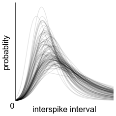

# Bayesian nonparametric (non-)renewal processes

 

### Overview

This is the code repository for this [paper]().
Models are implemented in Python and JAX with dependencies on libraries listed below at the end.
See `data/` for data generation, preprocessing and visualization.
See notebooks in `notebooks/` for a examples on loading fitted models.
See `scripts/` for model fitting, analysis and plotting code.

### Dependencies

- [JAX](https://jax.readthedocs.io/en/latest/#)
- [TFP](https://www.tensorflow.org/probability)
- [NumPy](https://numpy.org/)
- [SciPy](https://scipy.org/)
- [tqdm](https://github.com/tqdm/tqdm)

Formatting done with [ufmt](https://pypi.org/project/ufmt/), run `ufmt format .`